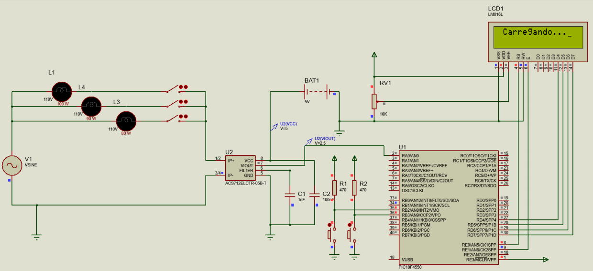

# Controle de Energia

<h2>Projeto de Controle de Energia realizado para a disciplina de Sistemas Microcontrolados</h2>

 

<h2>Objetivo</h2>

O objetivo do projeto é desenvolver um dispositivo no qual, por meio de um sensor instalados nas fontes de energia, captura a corrente gasta em cada fonte, envia esses dados para o conversor A/D do microcontrolador, o qual é responsável por realizar esta conversão do sinal analógico recebida pelo sensor e converter em sinal digital, armazenando esses dados coletados nas amostras em um determinado tempo na memória dinâmica, realizando a conversão para KWh e enviando o resultado para o display LCD, no qual  exibe de forma clara ao usuário os dados coletados do consumo de energia em KWh e seus respectivos valores de consumo por meio de dois botões que auxiliam na navegação da interface.

 

<h2>Operação da Solução</h2>

A operação do projeto é feita da seguinte forma: após ligar o dispositivo, a tela LCD irá exibir uma breve mensagem de carregamento, e então o usuário poderá utilizar dois botões de navegação para avançar ou retroceder as telas de dados. 
As opções de tela são: gasto por hora, previsão de gastos no mês e tela de créditos sobre o projeto. A tela de gasto por hora irá mostrar o valor, em reais, do consumo por hora dos equipamentos medidos pelo dispositivo. A tela de previsão dos dados irá mostrar o valor previsto, em reais, do consumo por mês, durante 6 horas diárias, dos equipamentos medidos pelo dispositivo. A última tela, dos créditos, irá exibir informações sobre a equipe responsável pelo desenvolvimento do projeto.

 

<h2>Prototipação</h2>

Foi utilizado o software Proteus para esboçar o circuito do projeto, já que este software possui o necessário para simular com êxito todos os dispositivos a serem utilizados. Para cumprir os requisitos e as especificações citadas anteriormente, ficou definido que seriam utilizados os seguintes dispositivos:

<li>1 x Microcontrolador PIC18F4550;
</li>
<li>1 x Sensor de Corrente ACS712 de 20 Amperes (20A-T);
</li>
<li>1 x LCD 16x2 LM016L;</li>
<li>1 x Lâmpada de 110v/80W;
</li>
<li>1 x Lâmpada de 110v/90W;
</li>
<li>1 x Lâmpada de 110v/100W;
</li>
<li>3 x Interruptores (Switch);
</li>
<li>1 x Fonte de Tensão (AC) de 110v;
</li>
<li>1 x Bateria (5v);
</li>
<li>1 x Capacitor 1nF;
</li>
<li>1 x Capacitor 100nF;</li>
<li>2 x Resistores de 370 ohms;
</li>
<li>2 x Push buttons
</li>
<li>1 x Trimpot 3361P de 10 Kohms.</li>

